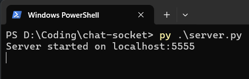
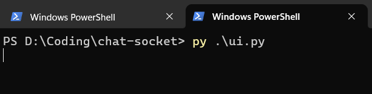
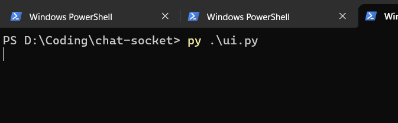
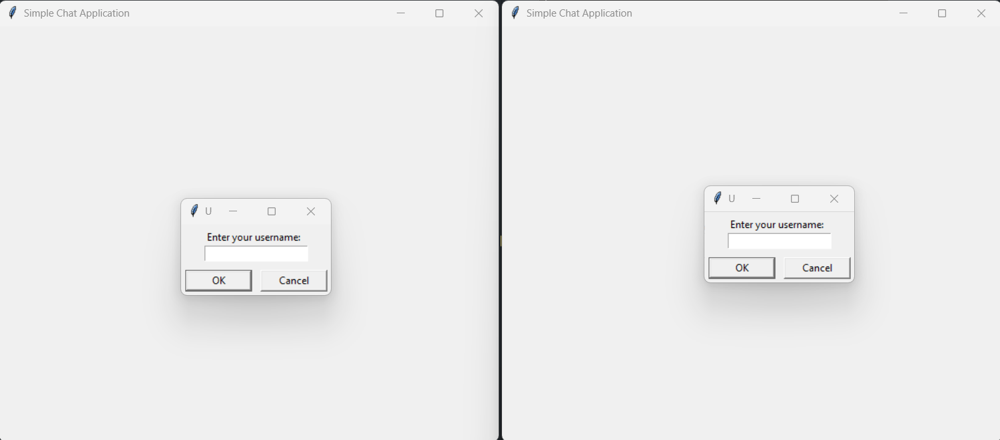
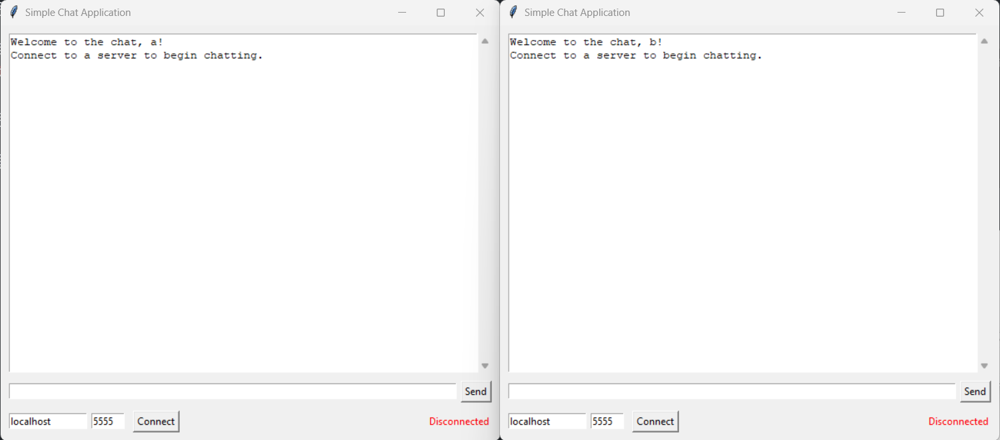
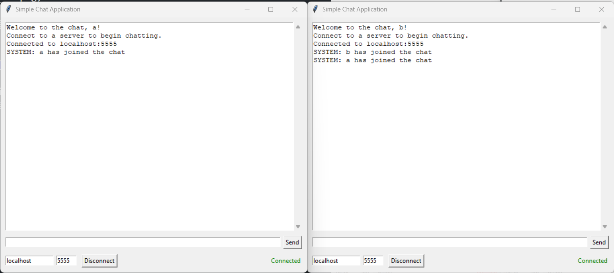
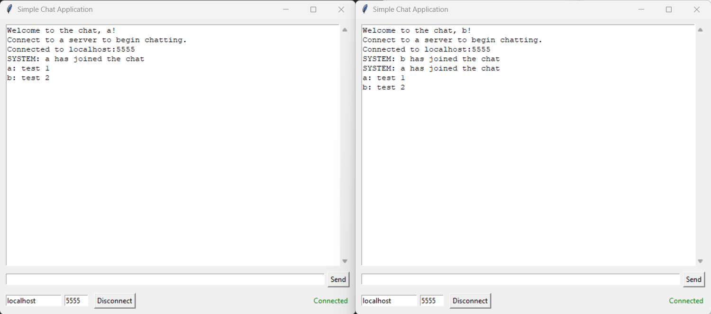

# Chat Socket Tutorial

## Hướng dẫn chạy

Để chạy ta sẽ cài đặt python.

Ta chạy server trước:

```bash
py server.py
```

hoặc

```bash
python server.py
```



Sau đó ta mở một terminal mới và chạy UI:

```bash
py UI.py
```



Và một terminal mới nữa cho UI của người thứ hai:



Lúc này trên màn hình sẽ có 2 UI, một cho người thứ nhất và một cho người thứ hai.



Sau khi nhập tên, ta nhấn vào nút "Connect" để kết nối với server.



Nếu kết nối thành công, ta sẽ thấy thông báo "Connected to server" trên UI.



Lúc này ta sẽ nhập tin nhắn là có thể sử dụng.



## Mục tiêu

Mục tiêu 1: Code ra một cái file như server.py bằng Spring Boot. Như vậy khi chạy ta sẽ chạy code Spring Boot trước và chỉ sử dụng `ui.py` để chạy UI.

Mục tiêu 2: Sau khi hiểu được cơ chế và có code của server, ta sẽ làm lại phần UI bằng một cái framework khác như React hoặc chỉ dùng HTML, CSS, JS thuần.
